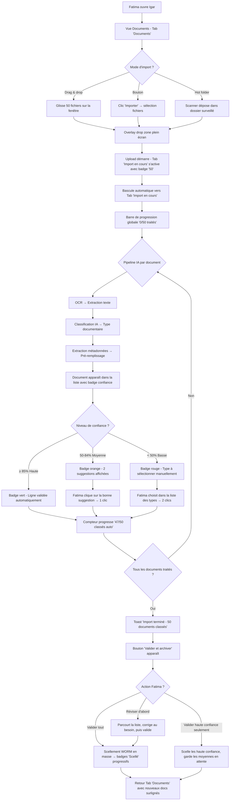
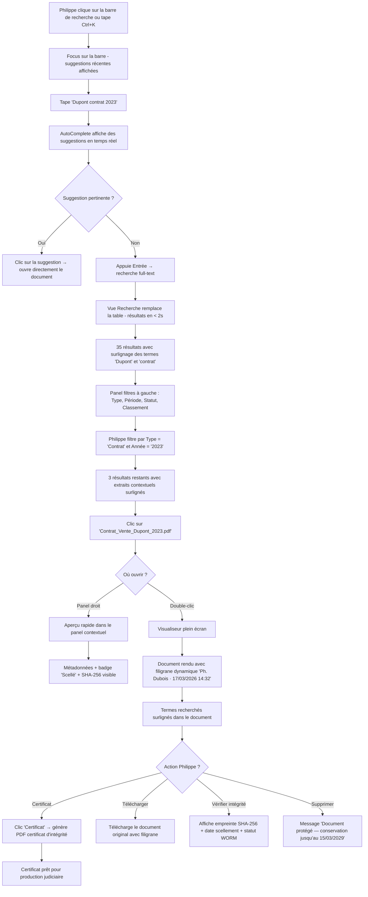
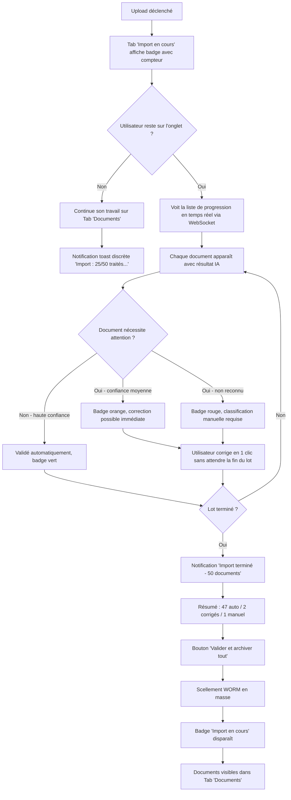
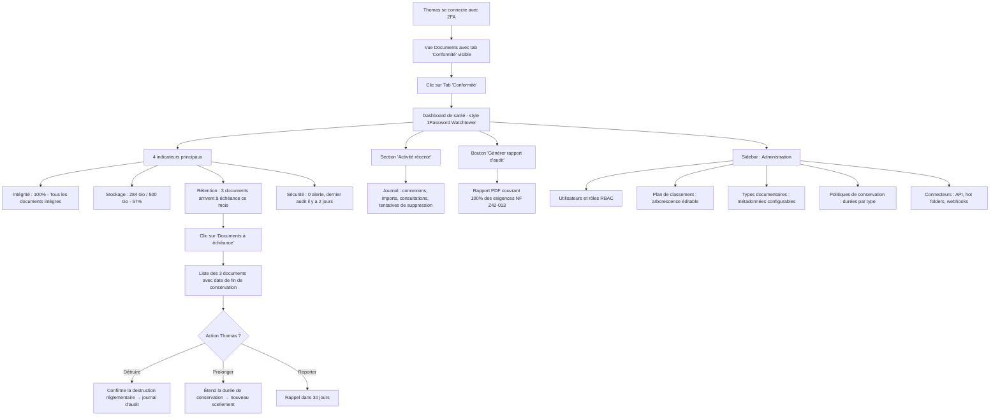

---
stepsCompleted:
  - step-01-init
  - step-02-discovery
  - step-03-core-experience
  - step-04-emotional-response
  - step-05-inspiration
  - step-06-design-system
  - step-07-defining-experience
  - step-08-visual-foundation
  - step-09-design-directions
  - step-10-user-journeys
  - step-11-component-strategy
  - step-12-ux-patterns
  - step-13-responsive-accessibility
  - step-14-complete
inputDocuments:
  - '_bmad-output/planning-artifacts/prd.md'
---

# UX Design Specification Igar

**Author:** Masy
**Date:** 2026-03-16

---

## Executive Summary

### Project Vision

Igar est une plateforme GED/SAE hybride qui réconcilie la fluidité d'une GED collaborative moderne et la rigueur juridique d'un SAE à valeur probante dans une expérience utilisateur unifiée. Le principe UX fondamental : la complexité technique (4 couches de sécurité, pipeline OCR/IA, scellement WORM) doit être totalement invisible pour l'utilisateur final.

### Target Users

| Persona | Profil | Niveau technique | Besoin UX dominant | Fréquence d'usage |
| --- | --- | --- | --- | --- |
| **Fatima** — Assistante admin | Mairie, 200+ docs/jour | Faible | Efficacité brute, zéro friction | Quotidien intensif |
| **Philippe** — Avocat | Cabinet 12 personnes, contrats sensibles | Moyen (métier) | Confiance visuelle, preuves immédiates | Quotidien modéré |
| **Amina** — Médecin | Clinique 80 lits, données HDS | Moyen | Accès rapide, tout en un écran | Quotidien critique |
| **Thomas** — Admin IT | PME 300 salariés | Élevé | Contrôle sans complexité, monitoring | Hebdomadaire |
| **Sarah** — Développeuse | Intégrateur partenaire | Élevé | API documentée, intégration rapide | Ponctuel (projet) |

**Contexte d'utilisation :** Bureau professionnel, desktop-first (1920x1080), souvent sous pression temporelle. Environnement réglementé où confiance et traçabilité sont critiques. Tablette paysage en secondaire, mobile post-MVP.

### Key Design Challenges

1. **Transparence de la complexité** — Rendre invisibles les 4 couches de sécurité, le pipeline OCR/IA et les mécanismes de scellement WORM derrière des interactions naturelles (déposer → valider → archivé).
2. **Double public** — Servir simultanément les utilisateurs non-techniques (Fatima, Amina) et les profils techniques (Thomas, Sarah) sans surcharger l'un ou frustrer l'autre.
3. **Communication de la confiance** — Transmettre visuellement l'intégrité et la conformité (badges, statuts, filigrane) sans générer d'anxiété ou de complexité perçue.
4. **Visualiseur universel cohérent** — Interface unifiée pour PDF, Office, images, audio, vidéo et archives ZIP avec filigrane dynamique serveur.

### Design Opportunities

1. **"Magic moment" capture IA** — Le drag & drop massif avec classification automatique comme moment différenciant : animation de progression soignée, résultats classifiés instantanément, correction en 1 clic.
2. **Confiance comme feature UX** — Badges de scellement, timeline cycle de vie, certificats en 1 clic : transformer la conformité réglementaire en atout UX visible et rassurant.
3. **Recherche comme hub central** — Barre de recherche "Google-like" comme point d'entrée principal de l'application, avec surlignage contextuel, filtres intelligents et navigation directe.

## Core User Experience

### Defining Experience

L'expérience fondamentale d'Igar se résume en une boucle primaire : **Capturer → Classer → Retrouver → Consulter**. Chaque itération de cette boucle doit être plus rapide et plus fiable qu'avec n'importe quelle solution concurrente ou processus manuel.

**Action #1 : Dépôt + Classification IA** — C'est l'interaction la plus fréquente (200+ fois/jour pour les utilisateurs intensifs), le moment différenciant en démo, et la porte d'entrée de toutes les fonctionnalités. Si cette action échoue, le produit échoue.

**Action #2 : Recherche Full-Text** — L'accès instantané à n'importe quel document dans un corpus de 100K+ est ce qui rend l'archivage utile au quotidien. La recherche est le hub de navigation central.

### Platform Strategy

| Aspect | Décision | Justification |
| --- | --- | --- |
| **Type** | SPA web desktop-first | Cible bureaux professionnels, pas de contrainte d'installation |
| **Résolution principale** | 1920x1080, min 1280px | Standard bureautique professionnel |
| **Input principal** | Souris + clavier | Drag & drop, raccourcis clavier, barre de recherche |
| **Secondaire** | Tablette paysage ≥ 768px | Consultation en réunion ou déplacement |
| **Mobile** | Post-MVP | Usage en mobilité non critique au démarrage |
| **Offline** | Non requis | Application on-premise, toujours connectée au réseau interne |
| **Temps réel** | WebSocket pour notifications et progression | Feedback instantané sur uploads et traitements OCR/IA |

### Effortless Interactions

**1. Drop → Classé (Zero-Click Classification)**
L'utilisateur dépose jusqu'à 500 fichiers. L'IA analyse, classifie et pré-remplit les métadonnées. L'utilisateur ne voit qu'une liste de résultats avec des badges de confiance (✅ haute confiance, ⚠️ à vérifier). Correction en 1 clic sur les cas ambigus.

**2. Chercher → Trouver → Voir (Unbroken Flow)**
Barre de recherche omniprésente. Résultats en < 2s avec surlignage des termes. Clic sur un résultat = ouverture directe dans le visualiseur intégré avec surlignage contextuel. Aucun changement de page, aucun téléchargement.

**3. Scellement Invisible (Trust by Default)**
Après validation des métadonnées, le scellement WORM, le chiffrement SSE-C et l'empreinte SHA-256 se déclenchent automatiquement en arrière-plan. L'utilisateur voit uniquement un badge "Scellé" apparaître. Zéro friction ajoutée par la conformité.

**4. Feedback Éducatif (Not Error, But Explanation)**
Tentative de suppression d'un document scellé → message clair : "Document protégé — conservation jusqu'au [date]. Raison : [politique]." Pas un blocage sec, mais une explication qui renforce la confiance dans le système.

### Critical Success Moments

| Moment | Ce que l'utilisateur doit ressentir | Indicateurs de succès |
| --- | --- | --- |
| **Premier dépôt massif** | "C'est magique, l'IA comprend mes documents" | ≥ 85% classés correctement, < 5s par document |
| **Première recherche** | "Plus rapide que Google sur mes propres fichiers" | Résultats pertinents en < 2s, surlignage précis |
| **Premier scellement** | "Mes documents sont en sécurité, sans effort" | Badge visible, certificat accessible en 1 clic |
| **Première consultation filigranée** | "Je vois tout sans quitter l'app, et c'est tracé" | Rendu immédiat, filigrane visible mais non intrusif |
| **La Démo Express (Preuve par 3)** | "Drag & drop → Suppression impossible → Recherche instantanée" | Les 3 moments fonctionnent sans accroc en < 60 secondes |

### Experience Principles

1. **Invisible Complexity** — Chaque couche technique (OCR, IA, WORM, SSE-C, SHA-256) doit être abstraite derrière une interaction simple et naturelle. L'utilisateur ne doit jamais voir la mécanique.
2. **Confidence by Design** — Chaque interaction doit renforcer la confiance : badges visuels, feedback immédiat, traçabilité visible (filigrane), impossibilité de perte. La sécurité est un atout UX, pas une contrainte.
3. **Speed is Trust** — La rapidité perçue (< 2s recherche, < 5s classification, rendu instantané) est ce qui différencie Igar d'un classement manuel. Chaque milliseconde gagnée renforce l'adoption.
4. **Progressive Disclosure** — Fatima voit une interface épurée de capture/recherche. Thomas accède aux dashboards et configurations avancées. Philippe voit les certificats et preuves d'intégrité. Chaque rôle ne voit que ce qui est pertinent.
5. **Forgiveness Over Prevention** — Plutôt que bloquer avec des confirmations, laisser agir et protéger par design (WORM empêche la suppression, versionnement préserve l'historique). Quand un blocage est nécessaire, expliquer plutôt qu'interdire.

## Desired Emotional Response

### Primary Emotional Goals

| Émotion cible | Description | Persona principale |
| --- | --- | --- |
| **Sérénité** | "Tout est protégé, je ne peux rien perdre" — La conformité et l'immuabilité génèrent la paix d'esprit | Philippe, Amina |
| **Émerveillement** | "L'IA fait le travail à ma place" — Le moment de classification automatique crée le "wow" | Fatima |
| **Confiance absolue** | "La preuve est cryptographique et vérifiable" — L'intégrité est visible et indiscutable | Philippe |
| **Maîtrise** | "Je retrouve tout en 2 secondes dans 100 000 documents" — Le contrôle total sur le volume | Fatima, Amina |
| **Efficacité satisfaisante** | "Ce qui prenait 2 heures prend 4 minutes" — Le gain de temps est quantifiable et ressenti | Tous |

### Emotional Journey Mapping

| Phase | Émotion visée | Déclencheur UX |
| --- | --- | --- |
| **Découverte / Démo** | Surprise + "Wow" | Drag & drop de 50 docs classés en quelques secondes |
| **Premier usage réel** | Soulagement + Confiance | "Ça marche vraiment avec mes documents" |
| **Usage quotidien** | Flow + Efficacité silencieuse | Boucle capture → recherche → consultation devenue réflexe |
| **Problème / Erreur** | Compréhension + Contrôle | Message explicatif, solution claire, pas de panique |
| **Retour après absence** | Familiarité + Continuité | Interface stable, rien n'a bougé |
| **Audit de conformité** | Fierté + Tranquillité | Rapport généré en 1 clic, tout est en ordre |

### Micro-Emotions

**À cultiver :**
- **Confiance > Scepticisme** — Badge "Scellé" + empreinte SHA-256 accessible en 1 clic
- **Accomplissement > Frustration** — Compteur de progression "47/50 classés automatiquement"
- **Calme > Anxiété** — Filigrane et protection WORM rassurent plutôt qu'inquiètent
- **Maîtrise > Confusion** — Progressive disclosure adapté au rôle utilisateur

**À éviter absolument :**
- **Peur** — Pas de messages alarmistes. La protection WORM rassure, ne menace pas
- **Culpabilité** — Si l'IA se trompe, c'est un cas ambigu à corriger, pas une erreur utilisateur
- **Submersion** — Jamais d'interface surchargée, un niveau de profondeur à la fois
- **Doute** — Feedback visuel immédiat sur chaque action (toast, badge, animation)

### Design Implications

| Émotion cible | Implication UX concrète |
| --- | --- |
| Sérénité | Indicateurs de statut permanents (scellé, intègre, en cours). Tableau de bord conformité avec "tout va bien" par défaut |
| Émerveillement | Animation fluide de classification IA avec badges de confiance apparaissant un par un. Compteur de gain de temps |
| Confiance absolue | Certificats accessibles en 1 clic depuis tout document. Timeline d'historique visible. Empreinte vérifiable |
| Maîtrise | Barre de recherche omniprésente, résultats instantanés, filtres puissants mais optionnels |
| Efficacité | Raccourcis clavier pour les power users, actions par lot, validation en masse des métadonnées IA |

### Emotional Design Principles

1. **Reassurance Permanente** — L'interface communique en permanence que "tout va bien" : badges verts, indicateurs de conformité, compteurs d'intégrité. L'absence de problème est un message actif, pas un silence.
2. **Célébration Discrète** — Les succès sont reconnus (animation de scellement, compteur de classement) mais jamais intrusifs. Pas de confettis, mais un feedback satisfaisant.
3. **Transparence sur Demande** — L'information technique (SHA-256, Object Lock, durée de conservation) est toujours accessible mais jamais imposée. Un clic pour voir les détails, zéro clic pour être rassuré.
4. **Erreur = Opportunité** — Chaque erreur ou blocage devient un moment d'éducation : "Ce document est protégé parce que..." transforme une frustration potentielle en compréhension de la valeur.
5. **Rythme Humain** — Les animations suivent un rythme naturel (200-300ms). Ni trop lentes (impression de lenteur), ni trop rapides (impression de ne pas contrôler). Le système respire avec l'utilisateur.

## UX Pattern Analysis & Inspiration

### Inspiring Products Analysis

**1. TeamViewer Desktop — Design épuré et confiance technique**

TeamViewer réussit un défi très proche du nôtre : rendre une opération techniquement complexe (accès distant, tunneling réseau, chiffrement AES-256) totalement transparente derrière une interface minimaliste.

- **Connexion en 1 action** — Un ID + mot de passe, aucune configuration réseau visible. Parallèle direct avec le "Drop → Classé" d'Igar
- **Indicateurs de statut permanents** — Le badge vert "Prêt à se connecter" rassure sans expliquer la mécanique. Exactement notre besoin pour le badge "Scellé"
- **Panel latéral avec contacts/machines** — Navigation hiérarchique claire, progressive disclosure des détails techniques uniquement au survol/clic
- **Design sombre professionnel** — Communique la fiabilité et le sérieux sans austérité

**2. Google Drive — Fluidité documentaire de référence**

L'outil que les utilisateurs non-techniques connaissent déjà. Benchmark mental pour la gestion documentaire.

- **Drag & drop naturel** — Zone de dépôt omniprésente, feedback d'upload instantané avec barre de progression
- **Recherche "Google-like"** — Barre en haut, résultats instantanés, filtres par type/date/propriétaire
- **Prévisualisation intégrée** — Clic = ouverture directe dans le viewer, pas de téléchargement
- **Organisation flexible** — Dossiers classiques + recherche puissante, l'utilisateur choisit son mode

**3. Notion — Intelligence de l'organisation**

Le modèle pour le progressive disclosure et la densité d'information maîtrisée.

- **Pages dans des pages** — Hiérarchie infinie mais visible un niveau à la fois. Parallèle avec notre plan de classement à 6 niveaux
- **Blocs modulaires** — Chaque élément est autonome et manipulable. Inspiration pour les métadonnées de document
- **Barre de commandes (/)** — Raccourcis clavier puissants pour les power users, invisibles pour les débutants
- **Templates** — Structures pré-remplies qui accélèrent la saisie. Inspiration pour nos types documentaires avec métadonnées pré-configurées

**4. 1Password — Confiance et sécurité comme UX**

Le meilleur exemple de sécurité transformée en atout UX.

- **Vault visuel** — L'icône de coffre-fort rassure. Les badges de sécurité (compromis, faible, fort) sont des indicateurs visuels immédiats
- **Watchtower** — Dashboard de santé sécuritaire. Parallèle direct avec notre tableau de bord conformité
- **Copier en 1 clic** — L'action sécurisée la plus fréquente est aussi la plus rapide. Notre certificat en 1 clic doit suivre cette logique
- **Auto-remplissage** — La sécurité qui fait gagner du temps plutôt qu'en perdre. Exactement notre scellement invisible

### Transferable UX Patterns

**Patterns de navigation :**

- **Barre de recherche omniprésente** (Google Drive) — Point d'entrée principal, toujours visible, résultats instantanés
- **Panel latéral hiérarchique** (TeamViewer) — Navigation dans le plan de classement avec collapse/expand, détails au survol
- **Breadcrumb contextuel** (Notion) — Position dans la hiérarchie toujours visible, navigation en 1 clic

**Patterns d'interaction :**

- **Drop zone universelle** (Google Drive) — Toute la surface est zone de dépôt, feedback visuel immédiat
- **Badges de statut inline** (1Password) — Indicateurs visuels compacts directement sur chaque élément (scellé, en traitement, à vérifier)
- **Actions au survol** (Notion) — Les actions secondaires apparaissent au hover, interface épurée par défaut

**Patterns de confiance :**

- **Dashboard de santé** (1Password Watchtower) — Vue synthétique "tout va bien" avec drill-down sur les alertes
- **Connexion verte** (TeamViewer) — Indicateur permanent de statut système, rassurant sans être intrusif
- **Historique des versions** (Google Drive) — Timeline visuelle des modifications, restauration en 1 clic

**Patterns de performance perçue :**

- **Skeleton loading** (Notion) — Placeholder structurel pendant le chargement, pas de spinner vide
- **Optimistic UI** (Google Drive) — L'action semble instantanée, la synchronisation suit en arrière-plan
- **Barre de progression contextuelle** (TeamViewer) — Progression visible sans bloquer l'interface

### Anti-Patterns to Avoid

- **SharePoint syndrome** — Navigation labyrinthique avec trop de niveaux, menus contextuels imbriqués, configuration visible partout. L'utilisateur se perd avant de trouver son document
- **Alfresco complexity** — Exposer les workflows BPM et les métadonnées techniques directement à l'utilisateur final. La puissance ne doit pas signifier complexité visible
- **Confirmation fatigue** — "Êtes-vous sûr ?" à chaque action. Contre notre principe "Forgiveness Over Prevention" — protéger par design (WORM), pas par dialogue modal
- **Feature dump sidebar** — Panneau latéral avec 30+ options visibles. Chaque rôle ne doit voir que ses 5-7 actions pertinentes
- **Téléchargement obligatoire** — Forcer le download pour consulter un document. Notre visualiseur intégré élimine cette friction
- **Jargon technique exposé** — "Objet verrouillé en mode Compliance avec rétention de 3652 jours" au lieu de "Document protégé jusqu'au 15/03/2036"

### Design Inspiration Strategy

**Ce qu'on adopte :**

- Barre de recherche comme hub central (Google Drive) — Cœur de l'expérience Igar
- Badges de statut inline compacts (1Password) — Notre système de confiance visuelle
- Dashboard de santé sécuritaire (1Password Watchtower) — Tableau de bord conformité "tout va bien"
- Skeleton loading + optimistic UI (Notion/Drive) — Performance perçue maximale

**Ce qu'on adapte :**

- Drop zone universelle (Drive) → enrichie avec classification IA et badges de confiance
- Panel latéral hiérarchique (TeamViewer) → adapté au plan de classement NF Z42-013 à 6 niveaux
- Templates pré-remplis (Notion) → types documentaires avec métadonnées automatiques par l'IA
- Historique des versions (Drive) → timeline de cycle de vie avec scellement et preuves d'intégrité

**Ce qu'on évite :**

- Navigation profonde type SharePoint — Max 3 clics pour atteindre tout document
- Configuration exposée type Alfresco — Admin IT uniquement, progressive disclosure strict
- Confirmations bloquantes — WORM protège par design, pas par dialogue modal
- Jargon technique — Langage humain partout, détails techniques sur demande uniquement

## Design System Foundation

### Design System Choice

**React + Ant Design (antd) + Pro Components** — Système thématisable avec composants enterprise prêts à l'emploi.

| Couche | Package | Rôle |
| --- | --- | --- |
| Composants de base | `antd` | 60+ composants UI (Button, Input, Table, Tree, Modal, etc.) |
| Composants enterprise | `@ant-design/pro-components` | ProTable, ProForm, ProLayout — composants métier avancés |
| Icônes | `@ant-design/icons` | Bibliothèque d'icônes cohérente |
| Thème | ConfigProvider + Design Tokens | Personnalisation couleurs, typographie, spacing |

### Rationale for Selection

1. **Adéquation métier** — ProTable (liste documentaire avec tri/filtre/export), Tree/DirectoryTree (plan de classement NF Z42-013), ProForm (métadonnées par type documentaire) couvrent ~70% des besoins UI d'Igar sans code custom
2. **Productivité** — Les Pro Components évitent des semaines de développement sur les interfaces data-heavy (tables, formulaires wizard, layout par rôle)
3. **Maturité enterprise** — Utilisé par Alibaba, Tencent, Baidu pour des applications à grande échelle. Accessibilité intégrée, i18n natif (FR inclus)
4. **Écosystème React** — Accès à React DnD (drag & drop massif), react-pdf (visualiseur), react-virtualized (listes 100K+), écosystème le plus riche
5. **Open source MIT** — Aucun coût de licence, aucun freemium, maintenance active par Ant Group
6. **Compatibilité architecture** — SPA React consommant l'API REST Django (fork Mayan EDMS), séparation front/back propre

### Implementation Approach

| Aspect | Décision |
| --- | --- |
| **Framework** | React 18+ avec TypeScript |
| **Design System** | Ant Design v6 + Pro Components |
| **State Management** | À définir en phase architecture |
| **Build** | Vite (rapide, tree-shaking optimal pour réduire le bundle Ant) |
| **Routing** | React Router v6 |
| **API Layer** | REST (Django REST Framework depuis Mayan EDMS) |

### Customization Strategy

- **Design Tokens** — Personnalisation via ConfigProvider : palette de couleurs Igar (teintes évoquant la confiance et la sérénité), typographie professionnelle, spacing cohérent
- **Composants wrappés** — Encapsuler les composants Ant critiques (DocumentTable, ClassificationTree, SealBadge) pour découpler le code métier de la librairie
- **Composants custom** — Le visualiseur universel filigrané et le widget de classification IA sont spécifiques à Igar et seront développés sur mesure
- **Thème sombre** — Post-MVP, facilité par le système de tokens Ant Design

## Defining Core Experience

### The Defining Interaction

**"Drop it, it's classified."** — L'utilisateur dépose des documents, l'IA les comprend.

C'est l'interaction que les utilisateurs décriront à leurs collègues : "Tu déposes tes 50 documents, et en quelques secondes ils sont tous classés, métadonnées remplies, prêts à être archivés." Ce moment est ce qui différencie Igar de toute solution GED/SAE existante.

### User Mental Model

**Modèle actuel (à remplacer) :** "Classer un document = 5 étapes manuelles, 3 minutes, corvée répétitive"

**Modèle cible Igar :** "Classer un document = le déposer. L'IA fait le reste."

| Aspect | Avant (GED classique) | Après (Igar) |
| --- | --- | --- |
| Classification | Choix manuel dans une liste de 50+ types | IA propose le type avec badge de confiance |
| Métadonnées | 5-15 champs à remplir manuellement | Pré-remplissage OCR/IA, validation en 1 clic |
| Rangement | Navigation dans l'arborescence | Placement automatique dans le plan de classement |
| Volume | 1 document à la fois | Jusqu'à 500 documents par lot |
| Temps par document | ~3 minutes | < 5 secondes |

**Raccourcis mentaux exploités :**

- **Familiarité du drag & drop** — Geste connu de tous (Google Drive, bureau Windows/Mac). Aucun apprentissage nécessaire
- **Métaphore du tri postal** — "Je dépose le courrier, quelqu'un le trie pour moi." L'IA est l'assistant invisible
- **Confiance par transparence** — Le badge de confiance (haute / à vérifier) permet de ne contrôler que les cas ambigus

### Success Criteria

| Critère | Seuil de succès | Mesure |
| --- | --- | --- |
| Précision classification | ≥ 85% sans intervention | % de documents correctement classés automatiquement |
| Temps par document | < 5 secondes (traitement IA) | Temps entre dépôt et résultat affiché |
| Correction cas ambigu | 1 clic (sélection dans une liste courte) | Nombre de clics pour corriger une classification |
| Volume par lot | Jusqu'à 500 documents | Nombre max accepté sans dégradation UX |
| Feedback continu | Barre de progression en temps réel | WebSocket push pour chaque document traité |
| Sentiment utilisateur | "C'est magique" | Réaction spontanée lors du premier usage |

### Novel vs. Established Patterns

**Pattern établi adopté :** Drag & drop de fichiers (Google Drive, Dropbox, WeTransfer). Geste universellement compris, aucune éducation nécessaire.

**Innovation Igar :** Ce qui se passe APRÈS le drop. Au lieu d'un simple upload, le système déclenche un pipeline invisible (OCR → extraction → classification IA → pré-remplissage métadonnées) et présente les résultats comme une liste triable avec badges de confiance.

**Métaphore d'éducation :** "Déposez vos documents comme dans Google Drive. Igar les comprend comme un assistant expérimenté." — Ancrage sur le familier, différenciation sur le résultat.

### Experience Mechanics

**1. Initiation — Le Drop**

- Zone de dépôt plein écran activée par le drag (overlay semi-transparent avec icône et texte "Déposez vos documents")
- Alternative : bouton "Importer" pour les utilisateurs clavier ou scanner
- Accepte : fichiers individuels, dossiers complets, sélections multiples
- Formats : PDF, Office (docx/xlsx/pptx), images (jpg/png/tiff), emails (.eml/.msg)

**2. Interaction — Le Pipeline Visible**

- Barre de progression globale "12/50 documents traités"
- Chaque document apparaît dans une liste au fur et à mesure avec son résultat :
  - Haute confiance : **Facture** — Fournisseur : Engie, Date : 15/03/2026, Montant : 1 247,50 €
  - Confiance moyenne : **Contrat ou Avenant ?** — 2 suggestions, cliquer pour choisir
  - Confiance basse : **Non reconnu** — Type à sélectionner manuellement (< 5% des cas)
- Animation fluide : chaque ligne apparaît avec un léger slide-in (200ms)

**3. Feedback — La Confiance Visuelle**

- Badge de confiance coloré sur chaque document (vert/orange/rouge)
- Compteur global : "47/50 classés automatiquement (94%)"
- Toast de succès discret en fin de lot : "50 documents importés et classés"
- Métadonnées pré-remplies visibles au survol, éditables au clic

**4. Completion — La Validation**

- Bouton "Valider et archiver" pour lancer le scellement WORM en masse
- Option "Valider les haute confiance, réviser les moyennes" pour un workflow rapide
- Après validation : badge "Scellé" apparaît progressivement sur chaque document
- Redirection vers la vue documents avec les nouveaux éléments surlignés

## Visual Design Foundation

### Color System

**Thème : "Océan Profond" — Confiance institutionnelle**

| Token | Couleur | Hex | Usage |
| --- | --- | --- | --- |
| **Primary** | Bleu marine profond | #1B3A5C | Navigation, headers, actions principales |
| **Primary Light** | Bleu marine clair | #2D5F8A | Hover, sélection active |
| **Primary Dark** | Bleu marine foncé | #122740 | Texte sur fond clair, emphase |
| **Secondary** | Bleu ciel | #4A90D9 | Liens, actions secondaires, icônes informatives |
| **Accent** | Vert émeraude | #10B981 | Badge "Scellé", validations, succès |
| **Warning** | Ambre | #F59E0B | Badge "À vérifier", confiance moyenne |
| **Error** | Rouge tempéré | #EF4444 | Erreurs, confiance basse, alertes |
| **Info** | Bleu clair | #3B82F6 | Notifications, messages informatifs |
| **Background** | Gris très clair | #F8FAFC | Fond principal de l'application |
| **Surface** | Blanc | #FFFFFF | Cartes, modales, panneaux |
| **Border** | Gris léger | #E2E8F0 | Séparations, contours de composants |
| **Text Primary** | Gris très foncé | #1E293B | Texte principal |
| **Text Secondary** | Gris moyen | #64748B | Labels, métadonnées, texte d'aide |
| **Text Disabled** | Gris clair | #94A3B8 | États désactivés |

**Sémantique des badges de confiance :**

- Vert émeraude (#10B981) — Scellé, intègre, haute confiance IA
- Ambre (#F59E0B) — À vérifier, confiance moyenne, en attente
- Rouge tempéré (#EF4444) — Non reconnu, confiance basse, erreur d'intégrité
- Bleu ciel (#4A90D9) — En cours de traitement, information

**Ratio de contraste :** Tous les couples texte/fond respectent WCAG 2.1 AA (≥ 4.5:1 pour le texte courant, ≥ 3:1 pour le texte large).

### Typography System

**Police principale : Inter**

Sans-serif optimisée pour les écrans, lisibilité excellente, caractères tabulaires pour les données chiffrées, support complet des accents français. Gratuite (Google Fonts), intégration native avec Ant Design.

| Niveau | Taille | Graisse | Line Height | Usage |
| --- | --- | --- | --- | --- |
| H1 | 28px | 600 (Semi-Bold) | 36px | Titre de page |
| H2 | 22px | 600 | 30px | Titre de section |
| H3 | 18px | 500 (Medium) | 26px | Sous-section |
| H4 | 16px | 500 | 24px | Titre de carte, groupe |
| Body | 14px | 400 (Regular) | 22px | Texte courant, cellules de tableau |
| Small | 12px | 400 | 18px | Labels, badges, métadonnées |
| Caption | 11px | 400 | 16px | Horodatages, infos tertiaires |

**Principes typographiques :**

- Graisse 600 réservée aux titres, jamais dans le corps de texte
- Chiffres tabulaires activés dans les tableaux pour alignement vertical
- Pas de polices décoratives — Inter partout pour la cohérence
- Contraste de graisse (400 vs 600) comme principal outil de hiérarchie

### Spacing & Layout Foundation

**Grille de base : 8px**

| Token | Valeur | Usage |
| --- | --- | --- |
| xs | 4px | Espace intra-composant (icône ↔ label) |
| sm | 8px | Espace entre éléments liés |
| md | 16px | Espace entre composants |
| lg | 24px | Espace entre sections |
| xl | 32px | Espace entre zones majeures |
| xxl | 48px | Marge de page |

**Layout principal (ProLayout) :**

| Zone | Dimension | Comportement |
| --- | --- | --- |
| **Sidebar gauche** | 220px (repliable → 64px) | Plan de classement, navigation par rôle |
| **Header fixe** | 56px | Barre de recherche, profil, notifications |
| **Zone de contenu** | Fluide (min 800px) | Liste documents, visualiseur, formulaires |
| **Panel droit** (optionnel) | 320px (rétractable) | Détails document, métadonnées, timeline |

**Densité : Compacte (mode `size="small"` Ant Design)** — Usage intensif (200+ docs/jour), maximiser l'information visible. Tables avec lignes de 40px au lieu de 56px, formulaires condensés.

**Points de rupture :**

| Breakpoint | Largeur | Adaptation |
| --- | --- | --- |
| Desktop XL | ≥ 1920px | Layout complet avec panel droit |
| Desktop | ≥ 1280px | Layout complet, panel droit en overlay |
| Tablette paysage | ≥ 768px | Sidebar repliée par défaut, pas de panel droit |
| Mobile | < 768px | Post-MVP |

### Accessibility Considerations

- **Contraste WCAG 2.1 AA** — Minimum 4.5:1 pour le texte courant, 3:1 pour le texte large et les composants UI
- **Focus visible** — Outline bleu ciel (#4A90D9) de 2px sur tous les éléments interactifs au clavier
- **Taille de cible** — Minimum 44x44px pour les zones cliquables (WCAG 2.5.8)
- **Pas de couleur seule** — Les badges utilisent couleur + icône + texte (accessible aux daltoniens)
- **Navigation clavier** — Tous les flux principaux (recherche, upload, validation) accessibles sans souris
- **Lecteur d'écran** — Labels ARIA sur tous les composants Ant Design, rôles sémantiques sur les zones de layout
- **Zoom** — Interface fonctionnelle jusqu'à 200% de zoom sans perte de fonctionnalité

## Design Direction Decision

### Design Directions Explored

6 directions de design ont été explorées via un prototype HTML interactif (`ux-design-directions.html`) :

| # | Direction | Concept | Persona optimale |
| --- | --- | --- | --- |
| 1 | Command Center | Dashboard dense, stats, monitoring | Thomas (Admin IT) |
| 2 | Clean Workspace | Épuré, drop zone centrale, minimaliste | Amina (Médecin) |
| 3 | Split View | Liste + visualiseur intégré, façon Outlook | Philippe (Avocat) |
| 4 | Search-First | Recherche dominante, résultats plein écran | Fatima (usage intensif) |
| 5 | Card Grid | Vignettes visuelles, style Google Drive | Tous (navigation visuelle) |
| 6 | Hybrid Flow | Table + panel contextuel, multi-vues, tabs | Tous |

### Chosen Direction

**Direction 6 : Hybrid Flow** — Interface polyvalente combinant table de documents principale, panel contextuel droit, tabs de navigation, et toggle entre vues table/cartes.

**Éléments clés de la direction :**

- **Table principale** — ProTable Ant Design avec colonnes triables, filtres, sélection par lot, checkbox pour actions en masse
- **Panel contextuel droit** (320px, rétractable) — Aperçu document, métadonnées, badges d'intégrité, timeline cycle de vie, actions rapides (Ouvrir, Certificat)
- **Tabs de navigation** — Basculement entre "Documents", "Import en cours", "Conformité" sans changement de page
- **Toggle table/cartes** — L'utilisateur choisit sa vue préférée selon le contexte
- **Sidebar gauche** (220px) — Plan de classement hiérarchique avec compteurs, navigation par rôle
- **Header fixe** — Barre de recherche omniprésente + bouton Import + notifications

### Design Rationale

1. **Polyvalence multi-persona** — La table dense sert Fatima (200+ docs/jour), le panel contextuel sert Philippe (preuves et métadonnées), les tabs servent Thomas (monitoring conformité), la vue cartes sert les utilisateurs visuels
2. **Progressive disclosure naturel** — La table montre l'essentiel, le panel révèle les détails au clic, le visualiseur plein écran s'ouvre en second niveau
3. **Cohérence avec ProLayout** — La structure sidebar + header + contenu + panel s'implémente directement avec Ant Design ProLayout et ProTable
4. **Scalabilité** — La table gère 100K+ documents avec virtualisation, les filtres et la recherche réduisent le bruit, le panel contextuel évite les changements de page
5. **Familiarité** — Le pattern table + panel latéral est connu des utilisateurs d'Outlook, Gmail, Jira — courbe d'apprentissage minimale

### Implementation Approach

**Composants Ant Design impliqués :**

| Zone | Composant | Fonctionnalité |
| --- | --- | --- |
| Shell | ProLayout | Sidebar, header, routing |
| Documents | ProTable | Table avec filtres, tri, pagination, sélection |
| Panel droit | Drawer ou panneau fixe | Métadonnées, aperçu, timeline, actions |
| Tabs | Tabs | Navigation Documents / Import / Conformité |
| Toggle vue | Segmented | Basculement table ↔ cartes |
| Plan de classement | Tree / DirectoryTree | Navigation hiérarchique avec drag & drop |
| Recherche | Input.Search + AutoComplete | Barre omniprésente avec suggestions |
| Badges | Tag + Badge | Statuts scellé/à vérifier/en cours |

**Vues contextuelles :**

- **Vue Documents** — Table + panel (mode par défaut)
- **Vue Import** — Drop zone + liste de progression IA avec badges de confiance
- **Vue Conformité** — Dashboard de santé (stats, alertes, rapport)
- **Vue Visualiseur** — Ouverture plein écran avec filigrane dynamique (depuis le panel ou double-clic)
- **Vue Recherche** — Résultats full-text avec surlignage (prend le relais de la table)

## User Journey Flows

### Journey 1 : Dépôt + Classification IA (Fatima)

**Contexte :** Fatima arrive le lundi matin avec 50 courriers scannés (`scan_001.pdf` à `scan_050.pdf`). Elle doit les classer en moins de 5 minutes.

**Flux :**

**Durée cible :** < 5 minutes pour 50 documents (vs 2h en classement manuel)

**Points de friction anticipés :**

- Le hot folder ne donne pas de feedback visuel → notification push "12 nouveaux documents détectés"
- Upload de 500 fichiers lourds → barre de progression avec estimation du temps restant
- Connexion interrompue pendant l'upload → reprise automatique, pas de perte

### Journey 2 : Recherche + Consultation (Philippe)

**Contexte :** Philippe doit retrouver un contrat signé il y a 3 ans pour le produire devant un tribunal. Il tape le nom du client dans la barre de recherche.

**Flux :**

**Durée cible :** < 30 secondes de la recherche au document affiché

**Points de friction anticipés :**

- Résultats trop nombreux → filtres intelligents pré-cochés selon le contexte
- Termes de recherche approximatifs → recherche floue tolérante aux fautes
- Document long (100+ pages) → navigation par surlignage "occurrence suivante"

### Journey 3 : Import en cours + Validation (Flux transversal)

**Contexte :** Pendant que le pipeline IA traite un lot, l'utilisateur peut continuer à travailler. Le tab "Import en cours" montre la progression en temps réel.

**Flux :**

**Points clés UX :**

- L'utilisateur n'est JAMAIS bloqué pendant le traitement
- Les corrections peuvent être faites au fil de l'eau, pas seulement à la fin
- Le compteur sur le tab "Import en cours" tient informé sans interrompre

### Journey 4 : Administration + Conformité (Thomas)

**Contexte :** Thomas vérifie l'état du système chaque semaine et gère les alertes de conformité.

**Flux :**

**Points clés UX :**

- Le dashboard "tout va bien" par défaut rassure Thomas sans l'obliger à fouiller
- Les alertes sont proactives (notification push) et non passives
- Le rapport d'audit en 1 clic évite des heures de préparation manuelle

### Journey Patterns

**Patterns récurrents identifiés dans les 4 journeys :**

| Pattern | Description | Journeys |
| --- | --- | --- |
| **Feedback progressif** | Barre de progression + compteur + apparition progressive des résultats | J1, J3 |
| **Badge de confiance** | Vert/Orange/Rouge avec dot + texte pour communiquer l'état | J1, J2, J3 |
| **Action en 1 clic** | Correction classification, certificat, validation — toujours 1 clic | J1, J2 |
| **Recherche omniprésente** | Ctrl+K ou clic sur la barre → même expérience depuis n'importe quelle vue | J2 |
| **Notification non-bloquante** | Toast discret pour informer sans interrompre le flux de travail | J1, J3, J4 |
| **Dashboard de santé** | Vue "tout va bien" avec drill-down sur les problèmes | J4 |
| **Protection explicative** | Blocage WORM avec message humain expliquant le pourquoi | J2 |
| **Panel contextuel** | Clic = détails dans le panel droit, double-clic = plein écran | J2 |

### Flow Optimization Principles

1. **Zéro interruption** — L'utilisateur n'est jamais bloqué par un traitement en cours. Le pipeline IA tourne en arrière-plan, les corrections sont possibles au fil de l'eau
2. **Feedback continu** — Chaque action a un retour visuel immédiat : toast, badge, compteur, animation. Le silence est interdit
3. **Raccourci vers la valeur** — Chaque journey doit atteindre son "moment de succès" en ≤ 3 clics après le point d'entrée
4. **Récupération gracieuse** — Toute erreur (réseau, format invalide, classification échouée) produit un message actionnable, jamais un dead-end
5. **Contexte préservé** — Le retour arrière (bouton, Escape, breadcrumb) ramène toujours exactement à l'état précédent, sans perte de sélection ou de position

## Component Strategy

### Design System Components

**Composants Ant Design utilisés directement :**

| Composant Ant Design | Usage Igar | Journey |
| --- | --- | --- |
| ProLayout | Shell applicatif : sidebar + header + contenu | Tous |
| ProTable | Table de documents avec tri, filtres, pagination, sélection | J1, J2, J3 |
| Tree / DirectoryTree | Plan de classement hiérarchique | J1, J4 |
| ProForm / StepsForm | Formulaires de métadonnées, wizard de configuration | J1, J4 |
| Tabs | Navigation Documents / Import / Conformité | Tous |
| Input.Search + AutoComplete | Barre de recherche omniprésente | J2 |
| Tag | Badges de type documentaire | Tous |
| Badge | Compteurs sur les tabs (import en cours, à vérifier) | J1, J3 |
| Modal | Confirmations, détails, certificats | J2, J4 |
| Drawer | Panel contextuel droit (alternative au panneau fixe) | J2 |
| Notification / Message | Toasts et alertes non-bloquantes | Tous |
| Progress | Barres de progression upload et traitement IA | J1, J3 |
| Segmented | Toggle table ↔ cartes | Tous |
| Card | Vue cartes des documents | Tous |
| Timeline | Historique cycle de vie du document | J2, J4 |
| Descriptions | Affichage structuré des métadonnées | J2 |
| Statistic | Indicateurs dashboard conformité | J4 |
| Result | Pages de succès et d'erreur | Tous |
| Upload / Dragger | Zone de dépôt de fichiers | J1 |
| Skeleton | Placeholder pendant le chargement | Tous |
| Breadcrumb | Navigation dans le plan de classement | Tous |

**Couverture estimée : ~70% des besoins UI couverts nativement.**

### Custom Components

**Les 30% restants sont spécifiques au métier GED/SAE d'Igar :**

#### 1. ConfidenceBadge

**Purpose :** Communiquer visuellement le niveau de confiance IA et le statut de scellement d'un document.

**Anatomy :** Dot coloré (6px) + texte de statut + pourcentage optionnel. 3 niveaux : haute (vert), moyenne (orange), basse (rouge). 2 modes : confiance IA (pourcentage) et statut scellement (Scellé / En attente / Non classé).

**States :**

- `sealed` — Vert, dot plein, texte "Scellé"
- `high-confidence` — Vert, dot plein, texte "98%"
- `medium-confidence` — Orange, dot plein, texte "72% · 2 suggestions"
- `low-confidence` — Rouge, dot plein, texte "Non reconnu"
- `processing` — Bleu, dot animé (pulse), texte "En cours"
- `error` — Rouge, dot plein, texte "Erreur d'intégrité"

**Accessibility :** Label ARIA "Statut : scellé, confiance 98%". Icône en plus de la couleur pour les daltoniens.

#### 2. DocumentViewer

**Purpose :** Visualiseur universel intégré avec filigrane dynamique serveur. Rendu de PDF, Office, images, audio, vidéo sans téléchargement.

**Anatomy :** Zone de rendu (plein écran ou panel), toolbar (zoom, pagination, rotation, téléchargement, certificat), filigrane semi-transparent (nom utilisateur + horodatage) rendu côté serveur, surlignage des termes de recherche.

**States :**

- `loading` — Skeleton avec barre de progression
- `rendered` — Document affiché avec filigrane
- `search-highlight` — Termes surlignés avec navigation "occurrence suivante/précédente"
- `error` — Message "Format non supporté" ou "Document inaccessible"
- `fullscreen` — Mode plein écran avec overlay sombre

**Formats supportés :** PDF (react-pdf), Office (conversion serveur → PDF), Images (native), Audio/Vidéo (balise HTML5), ZIP (liste de contenu).

**Accessibility :** Navigation clavier (flèches pour pages, +/- pour zoom), alt text pour images, sous-titres pour vidéo.

#### 3. ClassificationResult

**Purpose :** Afficher le résultat de classification IA d'un document avec possibilité de correction en 1 clic.

**Anatomy :** Icône type de fichier (PDF/DOC/IMG/XLS), nom du fichier, type proposé par l'IA avec ConfidenceBadge, métadonnées pré-remplies (survolables), boutons de correction (2 suggestions alternatives en confiance moyenne), sélecteur de type complet (en confiance basse).

**States :**

- `auto-validated` — Haute confiance, ligne discrète, pas d'action requise
- `needs-review` — Confiance moyenne, 2 boutons de suggestion visibles
- `manual-required` — Confiance basse, sélecteur de type ouvert
- `corrected` — Après correction utilisateur, badge mis à jour
- `processing` — En attente de résultat IA, skeleton animé

**Interaction :** Clic sur une suggestion → corrige instantanément. Hover sur les métadonnées → popup détaillé.

#### 4. DropZoneOverlay

**Purpose :** Overlay plein écran qui apparaît quand l'utilisateur commence un drag de fichiers sur la fenêtre.

**Anatomy :** Fond semi-transparent (rgba primary-dark, 0.85), icône de document animée (bounce léger), texte "Déposez vos documents ici", sous-texte "Jusqu'à 500 fichiers · PDF, Office, Images, Emails", zone de drop bordée en pointillés animés.

**States :**

- `hidden` — Invisible par défaut
- `drag-enter` — Apparaît avec fade-in (200ms) quand un fichier est dragué sur la fenêtre
- `drag-over` — Bordure change de couleur (secondary → accent), icône pulse
- `drop` — Animation de confirmation, transition vers l'écran d'import
- `drag-leave` — Disparaît avec fade-out (150ms)

**Accessibility :** Alternative clavier : bouton "Importer" toujours accessible. L'overlay n'intercepte pas le focus clavier.

#### 5. ImportProgressList

**Purpose :** Liste en temps réel des documents en cours de traitement par le pipeline IA, avec résultats apparaissant progressivement.

**Anatomy :** Barre de progression globale ("12/50 traités"), compteur résumé ("47 auto / 2 à vérifier / 1 manuel"), liste de ClassificationResult avec animation slide-in, bouton "Valider et archiver" (apparaît quand lot terminé).

**States :**

- `uploading` — Upload en cours, progression par fichier
- `processing` — Pipeline IA actif, résultats apparaissent au fur et à mesure
- `completed` — Tous traités, résumé affiché, bouton de validation
- `partial-error` — Certains fichiers en erreur, indicateur clair

**Temps réel :** WebSocket push pour chaque document traité. Animation slide-in (200ms) pour chaque nouvelle ligne.

#### 6. SealBadge

**Purpose :** Badge spécifique indiquant qu'un document est scellé WORM avec accès rapide au certificat d'intégrité.

**Anatomy :** Icône cadenas + texte "Scellé", couleur verte (accent). Au clic : popover avec SHA-256 (tronqué), date de scellement, durée de conservation. Bouton "Certificat PDF" dans le popover.

**States :**

- `sealed` — Badge vert avec cadenas
- `hover` — Popover avec détails d'intégrité
- `generating-certificate` — Spinner pendant la génération du certificat PDF
- `protection-message` — Affiché lors d'une tentative de suppression : "Document protégé — conservation jusqu'au [date]"

#### 7. ComplianceDashboard

**Purpose :** Tableau de bord de santé du système pour l'administrateur (Thomas), style 1Password Watchtower.

**Anatomy :** 4 cartes Statistic (Intégrité, Stockage, Rétention, Sécurité), section "Alertes" avec liste des actions requises, section "Activité récente" (journal des 50 dernières actions), bouton "Générer rapport d'audit", graphiques de tendance (documents/mois, stockage/mois).

**States :**

- `healthy` — Tout vert, "Tout est conforme"
- `warning` — Cartes orange pour les éléments à surveiller
- `alert` — Cartes rouges pour les actions urgentes
- `generating-report` — Spinner pendant la génération du rapport d'audit

### Component Implementation Strategy

**Principe : Wrapper Pattern**

Chaque composant custom encapsule des composants Ant Design pour découpler le code métier de la librairie :

- `DocumentTable` → wraps ProTable
- `ClassificationTree` → wraps Tree / DirectoryTree
- `SealBadge` → wraps Tag + Popover
- `ConfidenceBadge` → wraps Badge + Tag
- `ComplianceDashboard` → wraps Statistic + Card + List

**Avantages :** Migration possible si Ant Design évolue, API métier stable indépendante de l'API technique, tests unitaires sur la logique métier.

### Component Implementation Roadmap

**Phase 1 — MVP Core (Sprint 1-3) :**

| Composant | Criticité | Dépendance Journey |
| --- | --- | --- |
| DropZoneOverlay | Critique | J1 — Point d'entrée de la defining experience |
| ImportProgressList | Critique | J1, J3 — Feedback du pipeline IA |
| ClassificationResult | Critique | J1 — Correction en 1 clic |
| ConfidenceBadge | Critique | J1, J2, J3 — Indicateur universel |

**Phase 2 — MVP Complet (Sprint 4-6) :**

| Composant | Criticité | Dépendance Journey |
| --- | --- | --- |
| DocumentViewer | Critique | J2 — Consultation avec filigrane |
| SealBadge | Haute | J2 — Preuve d'intégrité |
| ComplianceDashboard | Haute | J4 — Monitoring admin |

**Phase 3 — Post-MVP :**

| Composant | Criticité | Dépendance |
| --- | --- | --- |
| Thème sombre | Basse | Confort visuel |
| Vue mobile responsive | Basse | Usage en déplacement |
| Drag & drop réorganisation plan de classement | Moyenne | Administration avancée |

## UX Consistency Patterns

### Button Hierarchy

| Niveau | Style Ant Design | Usage Igar | Exemple |
| --- | --- | --- | --- |
| **Primaire** | `type="primary"` | Action principale unique par écran | "Valider et archiver", "Importer" |
| **Secondaire** | `type="default"` | Actions complémentaires | "Exporter", "Filtres", "Certificat" |
| **Tertiaire** | `type="text"` | Actions discrètes, inline | "Voir détails", "Modifier", "Annuler" |
| **Danger** | `danger` | Actions destructives (rares, WORM protège) | "Demander la destruction" |
| **Icône seule** | `shape="circle"` ou `type="text"` | Toolbar, actions compactes | Zoom, rotation, téléchargement |

**Règles :**

- Maximum 1 bouton primaire visible par zone de contenu
- Le bouton primaire est toujours à droite dans un groupe d'actions
- Les actions destructives demandent une confirmation modale avec explication (principe "Forgiveness Over Prevention")
- Taille `size="small"` par défaut (mode compact), `size="middle"` dans les modales

### Feedback Patterns

#### Succès

| Situation | Pattern | Durée | Exemple |
| --- | --- | --- | --- |
| Action rapide | Toast (`message.success`) | 3s, auto-dismiss | "Document scellé avec succès" |
| Action par lot | Toast persistant avec compteur | Jusqu'au clic | "50 documents archivés — Voir" |
| Fin de processus long | Notification (`notification.success`) | 5s | "Import terminé : 47 auto, 3 corrigés" |
| Badge de statut | ConfidenceBadge inline | Permanent | Badge vert "Scellé" sur la ligne |

#### Erreur

| Situation | Pattern | Action proposée | Exemple |
| --- | --- | --- | --- |
| Erreur récupérable | Toast warning avec lien d'action | "Réessayer" | "3 fichiers non importés — Réessayer" |
| Erreur bloquante | Modale avec explication | Bouton d'aide ou retry | "Format non supporté : .exe" |
| Protection WORM | Message inline (Result component) | Explication + date | "Document protégé — conservation jusqu'au 15/03/2029" |
| Erreur réseau | Banner en haut de page | Retry automatique | "Connexion interrompue — reconnexion en cours..." |

**Règle fondamentale :** Jamais de message technique brut. Chaque erreur utilise un langage humain et propose une action.

#### Information

| Situation | Pattern | Exemple |
| --- | --- | --- |
| Processus en cours | Barre de progression + compteur | "12/50 documents traités" |
| Aide contextuelle | Tooltip au survol (?) | "Le SHA-256 garantit l'intégrité du document" |
| Changement de statut | Badge animé (transition couleur) | Badge passant de bleu "En cours" à vert "Scellé" |
| Notification push | Badge compteur sur tab + toast | Tab "Import" avec badge "3" |

### Form Patterns

**Formulaire de métadonnées (ProForm) :**

- Les champs pré-remplis par l'IA sont visuellement distingués (fond légèrement teinté bleu, label "IA" discret)
- Les champs modifiés par l'utilisateur perdent le marqueur IA
- Validation inline en temps réel (pas de soumission pour voir les erreurs)
- Champs obligatoires marqués par astérisque rouge, optionnels sans marqueur
- Labels au-dessus des champs (pas inline) pour la lisibilité

**Formulaire de recherche :**

- Input unique avec autocomplétion
- Filtres en panneau latéral (pas dans la barre de recherche)
- Recherche déclenchée par Entrée ou sélection d'une suggestion
- Pas de bouton "Rechercher" visible — Entrée suffit

**Formulaire d'administration (Thomas) :**

- Wizard par étapes (StepsForm) pour les configurations complexes (plan de classement, politiques de conservation)
- Sauvegarde automatique de brouillon à chaque étape
- Aperçu avant validation finale

### Navigation Patterns

**Navigation principale :**

- Sidebar gauche permanente avec Tree pour le plan de classement
- Sidebar repliable (220px → 64px) via bouton hamburger ou raccourci
- Item actif surligné avec barre latérale bleue (secondary)
- Compteurs inline pour les éléments actionnables (à vérifier, import en cours)

**Navigation contextuelle :**

- Tabs pour basculer entre vues (Documents / Import / Conformité)
- Breadcrumb automatique reflétant la position dans le plan de classement
- Retour arrière : Escape ferme le panneau/modale, bouton retour revient à la vue précédente

**Navigation clavier :**

| Raccourci | Action |
| --- | --- |
| `Ctrl+K` / `Cmd+K` | Focus sur la barre de recherche |
| `Escape` | Fermer le panel/modale/overlay actif |
| `↑ / ↓` | Naviguer dans la liste de documents |
| `Entrée` | Ouvrir le document sélectionné dans le panel |
| `Ctrl+Entrée` | Ouvrir en plein écran |
| `Ctrl+I` / `Cmd+I` | Ouvrir la zone d'import |

### Empty States

| Situation | Message | Action |
| --- | --- | --- |
| Aucun document | "Aucun document dans ce dossier" | Bouton "Importer vos premiers documents" |
| Recherche sans résultat | "Aucun résultat pour '[terme]'" | "Essayez avec d'autres termes ou vérifiez les filtres" |
| Import vide | "Déposez vos documents ici" | Zone de drop + bouton "Parcourir" |
| Dashboard sans alerte | "Tout est conforme — aucune action requise" | Lien "Voir le dernier rapport d'audit" |
| Première connexion | "Bienvenue dans Igar" | Assistant de configuration en 3 étapes |

### Loading States

| Situation | Pattern | Durée attendue |
| --- | --- | --- |
| Chargement de page | Skeleton (ProTable Skeleton) | < 500ms |
| Recherche | Skeleton des résultats | < 2s |
| Upload de fichiers | Progress bar par fichier + globale | Variable |
| Pipeline IA | Progress bar + compteur + résultats progressifs | < 5s/doc |
| Génération certificat | Spinner inline dans le bouton | < 3s |
| Rendu visualiseur | Skeleton + barre de progression | < 2s |

**Règle :** Si le chargement dépasse 300ms, afficher un skeleton. Si dépasse 2s, afficher une estimation de temps restant.

### Modal & Overlay Patterns

| Type | Composant Ant | Usage | Fermeture |
| --- | --- | --- | --- |
| **Confirmation destructive** | Modal.confirm | Destruction programmée de documents | Bouton "Confirmer" + explication |
| **Détails document** | Drawer (droite, 320px) | Panel contextuel métadonnées + aperçu | Clic extérieur ou Escape |
| **Visualiseur plein écran** | Modal plein écran | Consultation document avec filigrane | Escape ou bouton fermer |
| **Import overlay** | Overlay custom (DropZoneOverlay) | Drag & drop de fichiers | Drop ou drag-leave |
| **Certificat** | Modal centré (480px) | Affichage et téléchargement du certificat | Escape ou bouton fermer |

**Règle :** Maximum 1 modale à la fois. Jamais de modale sur modale. Si une action secondaire est requise depuis une modale, utiliser un Drawer ou remplacer le contenu.

### Search & Filter Patterns

**Recherche :**

- Barre omniprésente dans le header (toujours visible)
- Ctrl+K pour focus immédiat
- Autocomplétion avec 5 suggestions max (documents récents + correspondances)
- Résultats avec surlignage des termes dans les extraits
- Recherche floue tolérante aux fautes de frappe

**Filtres :**

- Panneau latéral dans la vue recherche (pas inline dans la barre)
- Filtres combinables : Type documentaire, Période, Statut, Classement
- Filtres actifs affichés en Tags sous la barre de recherche (supprimables en 1 clic)
- Compteur de résultats mis à jour en temps réel lors du filtrage
- Bouton "Réinitialiser les filtres" visible dès qu'un filtre est actif

### Notification Patterns

| Type | Composant | Position | Durée | Usage |
| --- | --- | --- | --- | --- |
| **Action rapide** | message | Haut centre | 3s | "Copié", "Sauvegardé" |
| **Résultat d'opération** | notification | Haut droit | 5s | "Import terminé : 50 docs" |
| **Alerte système** | Banner (Alert) | Haut de page, pleine largeur | Persistant | "Connexion instable" |
| **Badge de tab** | Badge | Sur le tab | Jusqu'à consultation | "Import (3)" |
| **Temps réel** | WebSocket → notification | Haut droit | 5s | "12 nouveaux documents depuis le hot folder" |

**Règle :** Maximum 3 notifications visibles simultanément. Les plus anciennes disparaissent automatiquement.

## Responsive Design & Accessibility

### Responsive Strategy

**Approche : Desktop-First avec dégradation gracieuse**

Igar est un outil professionnel utilisé principalement sur des postes de bureau (1920x1080). La stratégie responsive vise la dégradation contrôlée vers tablette, le mobile étant post-MVP.

**Desktop (≥ 1280px) — Expérience complète :**

- Layout Hybrid Flow complet : sidebar (220px) + contenu + panel droit (320px)
- ProTable avec toutes les colonnes visibles
- Drop zone overlay plein écran
- Visualiseur avec panel de métadonnées latéral
- Raccourcis clavier complets

**Desktop XL (≥ 1920px) — Expérience étendue :**

- Panel droit affiché par défaut (pas en overlay)
- Table avec colonnes supplémentaires (confiance IA, taille fichier)
- Dashboard conformité avec graphiques de tendance élargis
- Espace supplémentaire dans le visualiseur

**Tablette paysage (768px — 1279px) — Expérience adaptée :**

- Sidebar repliée par défaut (64px, icônes seules), dépliable au tap
- Panel droit en Drawer overlay (pas fixe)
- Table avec colonnes réduites (Nom, Type, Date, Statut)
- Drop zone simplifiée (bouton "Importer" plus visible que le drag)
- Visualiseur plein écran uniquement (pas de split view)
- Cibles tactiles agrandies (48px minimum)

**Mobile (< 768px) — Post-MVP :**

- Navigation par bottom tabs (Documents, Recherche, Import, Profil)
- Liste de documents en cartes empilées (pas de table)
- Recherche en plein écran avec clavier natif
- Consultation documents uniquement (pas d'import massif)
- Pas de drag & drop (bouton "Importer" uniquement)

### Breakpoint Strategy

| Breakpoint | Largeur | Approche CSS | Changements clés |
| --- | --- | --- | --- |
| Mobile | < 768px | Post-MVP | Bottom nav, cartes, pas de sidebar |
| Tablette | 768px — 1279px | `@media (max-width: 1279px)` | Sidebar repliée, panel en Drawer, colonnes réduites |
| Desktop | 1280px — 1919px | Design par défaut | Layout complet, panel en overlay au clic |
| Desktop XL | ≥ 1920px | `@media (min-width: 1920px)` | Panel fixe, colonnes étendues |

**Unités :**

- Largeurs de layout : `px` fixes pour sidebar et panel (composants structurels)
- Contenus fluides : `%` et `flex` pour la zone de contenu centrale
- Typographie : `px` (Ant Design convention), pas de scaling responsive au MVP
- Spacing : tokens en `px` multiples de 8 (cohérent avec le système de spacing défini)

### Accessibility Strategy

**Niveau cible : WCAG 2.1 AA**

Obligatoire pour un outil professionnel déployé dans des collectivités (RGAA en France) et des établissements de santé.

#### Perception

| Critère | Exigence | Implémentation Igar |
| --- | --- | --- |
| **Contraste texte** | ≥ 4.5:1 (AA) | Vérifié pour tous les couples couleur/fond de la palette "Océan Profond" |
| **Contraste composants UI** | ≥ 3:1 (AA) | Bordures, icônes et badges testés contre le fond |
| **Pas de couleur seule** | Information transmise par couleur + forme + texte | ConfidenceBadge : dot + couleur + texte + icône |
| **Texte redimensionnable** | Fonctionnel jusqu'à 200% zoom | Layout flexible, pas de troncature à 200% |
| **Images informatives** | Alt text descriptif | Vignettes documents avec alt "[Type] - [Nom]" |
| **Contenu multimédia** | Sous-titres et transcriptions | Visualiseur vidéo avec piste de sous-titres si disponible |

#### Opérabilité

| Critère | Exigence | Implémentation Igar |
| --- | --- | --- |
| **Navigation clavier complète** | Tous les flux accessibles sans souris | Tab order logique, raccourcis Ctrl+K, flèches, Escape |
| **Focus visible** | Outline visible sur tous les éléments interactifs | Outline bleu ciel (#4A90D9) 2px, offset 2px |
| **Skip links** | Lien "Aller au contenu principal" | Premier élément focusable, visible au focus |
| **Pas de piège clavier** | Escape ferme toujours modales/overlays | DropZoneOverlay, Drawer, Modal : Escape = fermer |
| **Cibles tactiles** | ≥ 44x44px (WCAG 2.5.8) | Taille minimum pour tous les boutons et liens cliquables |
| **Pas de timing strict** | Pas de limite de temps sur les actions | Import et classification sans timeout utilisateur |

#### Compréhension

| Critère | Exigence | Implémentation Igar |
| --- | --- | --- |
| **Langue de page** | `lang="fr"` sur html | Déclaré dans le shell React |
| **Labels de formulaire** | Chaque champ a un label explicite | ProForm avec labels au-dessus des champs |
| **Messages d'erreur** | Identifient le champ et proposent une solution | Validation inline avec texte descriptif |
| **Navigation cohérente** | Même position et ordre sur toutes les pages | ProLayout garantit la cohérence |
| **Identification cohérente** | Mêmes termes pour les mêmes fonctions | Glossaire UX : "Scellé", "Importer", "Certificat" partout |

#### Robustesse

| Critère | Exigence | Implémentation Igar |
| --- | --- | --- |
| **HTML sémantique** | Landmarks, headings, listes structurées | `<main>`, `<nav>`, `<aside>`, `<h1>`-`<h4>` |
| **ARIA** | Rôles et propriétés sur les composants custom | `role`, `aria-label`, `aria-live`, `aria-expanded` |
| **Régions live** | Annonces dynamiques pour les lecteurs d'écran | `aria-live="polite"` sur les compteurs d'import et les toasts |
| **Compatibilité** | Fonctionne avec NVDA, VoiceOver, JAWS | Tests manuels sur les 5 journeys principaux |

### Testing Strategy

**Tests automatisés (CI/CD) :**

| Outil | Portée | Fréquence |
| --- | --- | --- |
| axe-core (via jest-axe) | Composants React unitaires | À chaque commit |
| Lighthouse CI | Audit accessibilité page entière | À chaque PR |
| Pa11y | Scan automatisé multi-pages | Quotidien (nightly) |
| eslint-plugin-jsx-a11y | Erreurs a11y dans le code JSX | À chaque commit |

**Tests manuels :**

| Test | Outil | Fréquence | Critère de succès |
| --- | --- | --- | --- |
| Navigation clavier | Clavier seul | Chaque sprint | 5 journeys complétables sans souris |
| Lecteur d'écran | NVDA (Windows) + VoiceOver (Mac) | Chaque release | Zéro blocage fonctionnel sur les 5 journeys |
| Daltonisme | Simulateur (Chrome DevTools) | Chaque release | Toutes les informations lisibles |
| Zoom 200% | Navigateur natif | Chaque release | Pas de perte de fonctionnalité |
| Tablette | iPad Pro paysage (réel ou simulateur) | Chaque release | Flux principaux fonctionnels |

**Tests responsive :**

| Device | Résolution | Navigateur | Priorité |
| --- | --- | --- | --- |
| Desktop standard | 1920x1080 | Chrome, Firefox, Edge | Critique |
| Desktop compact | 1280x720 | Chrome | Haute |
| iPad Pro paysage | 1024x768 | Safari | Haute |
| iPad paysage | 810x1080 | Safari | Moyenne |
| Mobile (post-MVP) | 375x812 | Safari, Chrome | Basse |

### Implementation Guidelines

**Pour les développeurs React + Ant Design :**

**Structure sémantique :**

- ProLayout génère automatiquement `<header>`, `<aside>`, `<main>` — ne pas surcharger
- Ajouter `<h1>` sur chaque vue (titre de page), `<h2>` pour les sections
- Utiliser `<nav aria-label="Plan de classement">` pour la sidebar Tree

**Composants Ant Design — accessibilité native :**

- ProTable : navigation clavier des lignes, tri accessible, annonces ARIA intégrées
- Modal/Drawer : focus trap automatique, Escape = fermer, restauration du focus
- Form : labels associés automatiquement via `name` prop
- Tree : navigation flèches, expand/collapse accessible

**Composants custom — checklist obligatoire :**

- `aria-label` descriptif sur chaque composant interactif
- `role` approprié si pas d'élément HTML sémantique natif
- `aria-live="polite"` sur les zones qui changent dynamiquement (compteurs, badges)
- `tabIndex` logique, pas de `tabIndex > 0`
- Gestion du focus : restaurer le focus après fermeture d'un overlay
- Tester avec NVDA avant chaque merge de composant custom

**Responsive :**

- Utiliser les breakpoints Ant Design (`xs`, `sm`, `md`, `lg`, `xl`, `xxl`) pour les grilles
- ProTable `scroll={{ x: true }}` pour le scroll horizontal sur tablette
- Drawer au lieu du panel fixe sous 1280px
- Tester chaque composant custom aux 4 breakpoints définis
